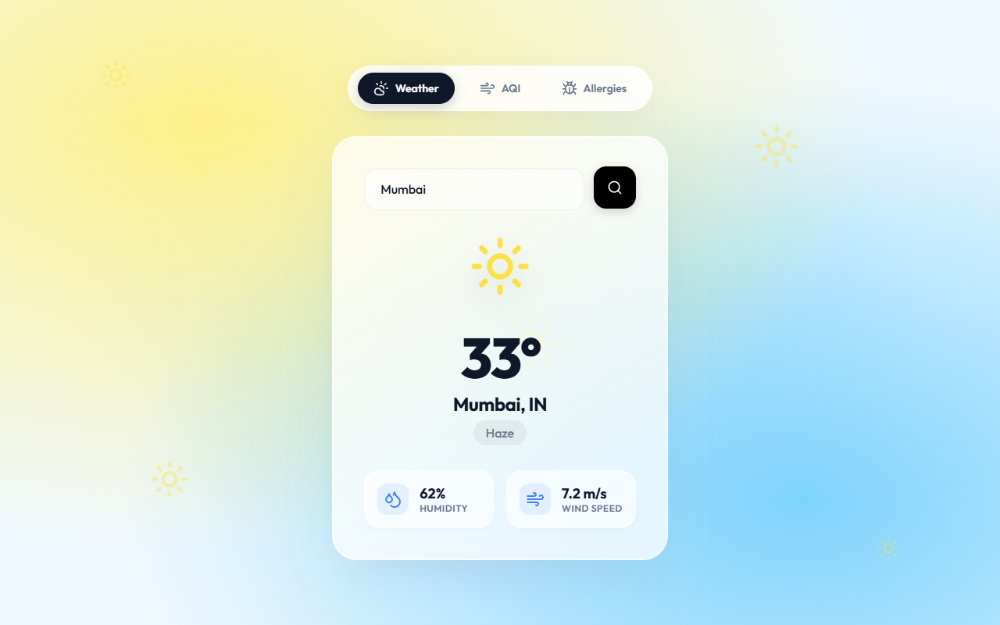
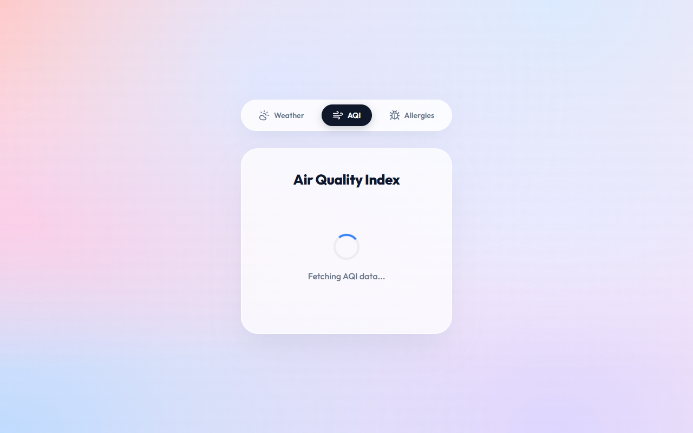
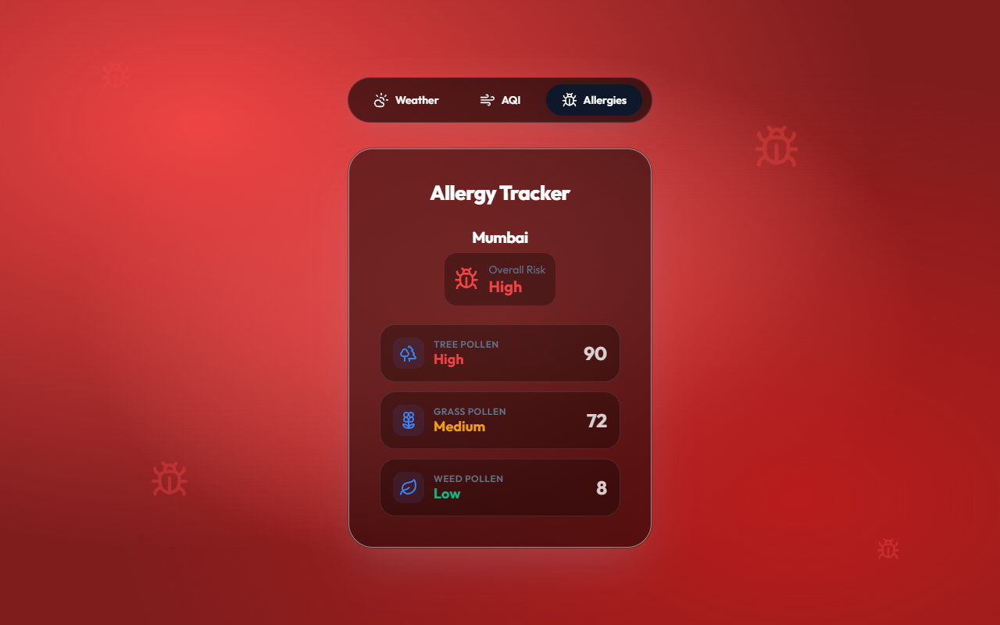

  <h1>ACADEMIC PROJECT REPORT</h1>
  <h2>Weather and Environmental Dashboard (AQI & Allergies)</h2>
     
  <h3>Submitted By:</h3>
  
<strong>Name:</strong> Dhanshree [Insert Last Name]

  
<strong>Roll Number:</strong> [Insert Roll No]

  
<strong>Course:</strong> B.Tech (Computer Science & Engineering)

  
<strong>Year/Semester:</strong> [Insert Year/Semester]

     
  <h3>Submitted To:</h3>
  
<strong>Department of Computer Science and Engineering</strong>

  
[Insert College/University Name]

  <h2>ACKNOWLEDGEMENT</h2>
  
I would like to express my profound gratitude to everyone who supported me throughout the course of this project. I am deeply thankful to my project guide, [Insert Guide Name], for their invaluable guidance, constant encouragement, and constructive feedback which helped in successfully completing this project.

  
I would also like to thank the Department of Computer Science and Engineering for providing the necessary resources and environment to foster learning and innovation.

   
  
<strong>Dhanshree</strong>

  <h2>ABSTRACT</h2>
  
With increasing environmental concerns and unpredictable weather patterns, having access to real-time, comprehensive atmospheric data is crucial. This project presents the "Weather and Environmental Dashboard," a responsive, full-stack web application designed to provide users with localized weather forecasts, Air Quality Index (AQI) reports, and localized Allergy/Pollen risk assessments.

  
Built using modern web technologies—React.js (Vite) for the frontend and Node.js with Express for the backend—the system aggregates data from OpenWeatherMap APIs. It features a dynamically responsive user interface that changes themes based on environmental conditions (e.g., turning green for Good AQI, or dark red for High Allergy risks), providing an intuitive and immersive user experience. The application is fully deployed and accessible via the Railway cloud platform.

  <h2>1. INTRODUCTION</h2>
  <h3>1.1 Project Overview</h3>
  
The Weather and Environmental Dashboard is a multi-page web application that goes beyond standard temperature readings. It integrates meteorological data with health-impacting environmental factors such as air pollution levels and pollen counts, offering users a holistic view of their local environment.

  <h3>1.2 Objectives</h3>
  <ul>
    <li>To develop a user-friendly, highly responsive Single Page Application (SPA).</li>
    <li>To integrate third-party RESTful APIs (OpenWeatherMap) for real-time data retrieval.</li>
    <li>To design an adaptive UI/UX that visually communicates environmental severity through dynamic backgrounds and animations.</li>
    <li>To deploy the application to a cloud provider (Railway) for global accessibility.</li>
  </ul>

  <h2>2. TECHNOLOGIES USED</h2>
  <h3>2.1 Frontend Development</h3>
  <ul>
    <li><strong>React.js (Vite):</strong> Used for building fast, reusable UI components.</li>
    <li><strong>React Router:</strong> Implemented for seamless client-side routing between pages without reloading.</li>
    <li><strong>Lucide React:</strong> Utilized for scalable, aesthetic SVG icons.</li>
    <li><strong>Vanilla CSS:</strong> Used for creating a custom Neo-Brutalism/Glassmorphism design system with CSS animations and variables.</li>
  </ul>
  <h3>2.2 Backend Development</h3>
  <ul>
    <li><strong>Node.js & Express.js:</strong> Serves as the middle-tier REST API, securely handling third-party API keys and proxying requests to overcome CORS restrictions.</li>
    <li><strong>Axios:</strong> Used for promise-based HTTP requests between the frontend and backend, and the backend and OpenWeatherMap.</li>
  </ul>
  <h3>2.3 Cloud & DevOps</h3>
  <ul>
    <li><strong>Git & GitHub:</strong> Version control and repository hosting.</li>
    <li><strong>Railway:</strong> Continuous Integration and Continuous Deployment (CI/CD) platform used for hosting the Node.js backend and serving the compiled static React build.</li>
  </ul>

  <h2>3. SYSTEM ARCHITECTURE</h2>
  
The system follows a standard Client-Server architecture:

  <ol>
    <li><strong>Client Layer:</strong> The React frontend captures the user's city input and makes a relative HTTP GET request to the backend.</li>
    <li><strong>Server Layer:</strong> The Node.js Express server receives the request, attaches the secure `WEATHER_API_KEY`, and queries the OpenWeatherMap API.</li>
    <li><strong>Data Layer:</strong> The OpenWeatherMap API processes the coordinates and returns JSON data (Temperature, Humidity, Wind Speed, AQI components).</li>
    <li><strong>Response:</strong> The Express server forwards this JSON payload back to the React client, which updates the state and triggers a dynamic re-render of the user interface.</li>
  </ol>

  <h2>4. IMPLEMENTATION & FEATURES</h2>
  <h3>4.1 Dynamic Backgrounds & Theming</h3>
  
A core feature of the project is the context-aware UI. The application reads the environmental data and dynamically assigns CSS classes to the document body. For example, a high AQI automatically shifts the application into an alert state (red gradient with warning icons), ensuring the user immediately recognizes the environmental risk.

  
  <h3>4.2 Module 1: Weather Dashboard</h3>
  
Allows users to search for any global city. Retrieves current temperature, weather conditions, humidity percentages, and wind speed. Coordinates (latitude and longitude) are cached in `localStorage` for cross-module use.

  <h3>4.3 Module 2: Air Quality Index (AQI)</h3>
  
Utilizes the cached coordinates to fetch real-time air pollution metrics. The system breaks down the AQI into specific chemical components (CO, NO2, O3, SO2, PM2.5, PM10) and assigns a severity rating from 1 (Good) to 5 (Very Poor).

  <h3>4.4 Module 3: Allergy Tracker</h3>
  
Evaluates pollen risks (Tree, Grass, Weed) and provides an overall risk assessment score, helping users prone to allergies plan their outdoor activities.

  <h2>5. RESULTS & SCREENSHOTS</h2>
  
  <h3>5.1 Weather Page (Clear Conditions)</h3>
  
The default dashboard displaying standard meteorological data with a bright, clear-weather theme.

  

    
  
  <h3>5.2 Air Quality Index (AQI) Page</h3>
  
Displaying detailed particulate matter breakdowns with severity color-coding.

  

    

  <h3>5.3 Allergy Tracker Page</h3>
  
Pollen risk assessments dynamically adapting to the user's selected city.

  

  <h2>6. CONCLUSION AND FUTURE SCOPE</h2>
  <h3>6.1 Conclusion</h3>
  
The Weather and Environmental Dashboard successfully demonstrates the integration of multiple APIs into a cohesive, responsive web application. The implementation of dynamic theming significantly enhances the user experience by visually communicating data severity. The project fulfills all functional requirements and is successfully deployed for public use.

  
  <h3>6.2 Future Enhancements</h3>
  <ul>
    <li><strong>Geolocation API:</strong> Automatically detect the user's location on startup instead of relying on manual search.</li>
    <li><strong>7-Day Forecast:</strong> Integrate a graphical representation (using libraries like Chart.js) for upcoming weather trends.</li>
    <li><strong>Push Notifications:</strong> Allow users to subscribe to alerts when AQI or Pollen levels reach dangerous thresholds in their area.</li>
  </ul>

